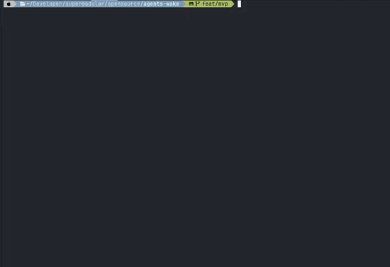

# wake

[](https://github.com/SupermodularAI/agents-wake/actions/workflows/ci.yml)
[](https://github.com/SupermodularAI/agents-wake/releases)
[](LICENSE)

Wake is a local CLI for understanding which agent primitives a developer uses,
which ones fail, and which ones are never used. It currently supports Claude
Code and collects only from projects the developer explicitly enables.



## Install

Official binaries are available for macOS and Linux on amd64 and arm64:

```sh
curl -fsSL https://raw.githubusercontent.com/SupermodularAI/agents-wake/main/install.sh | sh
```

The installer downloads the latest release, verifies its SHA-256 checksum, and
installs `wake` in `~/.local/bin` without `sudo`. It prints a PATH reminder when
needed. Releases also include an SBOM and GitHub build provenance.

To verify the installed binary's provenance with the GitHub CLI:

```sh
gh attestation verify ~/.local/bin/wake --repo SupermodularAI/agents-wake
```

To build from source, use Go 1.25 or newer:

```sh
git clone https://github.com/SupermodularAI/agents-wake.git
cd agents-wake
make install
```

`make install` builds and installs to `~/.local/bin` — the same place and
`WAKE_INSTALL_DIR` override the shell installer above uses — and tells you if
that directory isn't on your `PATH`. `make build` alone only builds
`dist/wake`; it isn't on `PATH`, so running `wake` from outside the repo
without `make install` (or `go install ./cmd/wake`, which puts it in
`$(go env GOPATH)/bin` instead) fails with a plain "command not found".

## Use

From the root of a project you want Wake to observe:

```sh
wake init
wake report
```

`wake report` prints usage for the primitives you've used. Add `--unused` to
see primitives that are available but never invoked, or both flags together
for the full picture. A bare `--unused` swaps the OVERVIEW too — invocation
counts and outcomes describe activity, so the overview above an unused list
is instead a count of unused primitives by kind. In a terminal the tables are
lime-bordered and colored; piped or redirected — a script, another program,
an agent reading the output — it's plain ASCII text instead, so nothing
downstream ever has to parse around a color code.

`wake init` explains what it will change before doing so. It consents the
current project and installs Wake-owned Claude Code session hooks, and
collection starts from that moment. Existing hooks are preserved.

On a terminal, `init`, `ingest`, `remove`, `uninstall`, `report` and `serve`
all show a lime spinner while their real work runs — importing history,
rebuilding the event store, refreshing the primitive inventory, removing the
integration — and confirm with a lime checkmark. Piped or redirected, every
one of them is the same plain, deterministic text instead.

Existing history is not imported by default, and nothing imports it later on
its own: the session hooks collect only what happens after `wake init`. When
you want the history, ask for it — `wake init --full` imports this project's
Claude Code history in the same call, and `wake ingest` does it afterwards for
a project that is already consented.

Open the local dashboard when you want a browser view:

```sh
wake serve
```

Wake listens only on [127.0.0.1:8080](http://127.0.0.1:8080). The hooks keep
collection current; use these commands when needed:

```sh
wake init --full        # Consent and import existing history now
wake ingest             # Re-scan consented history
wake ingest --rebuild   # Rebuild the derived event store
wake doctor             # Inspect collection and hook health
wake update             # Install the newest release, verifying its checksum
wake update --check     # Report whether a newer release exists; download nothing
wake remove             # Remove the Claude Code integration; keep local data
wake remove --purge     # ...and delete collected data; ~/.config/wake is kept
wake uninstall          # Remove everything, including ~/.config/wake and the binary
```

| Command | Purpose |
| --- | --- |
| `wake report` | Print local activity in the terminal: the primitives you've used. |
| `wake report --unused` | ...swap in the primitives available but never invoked. |
| `wake report --usage --unused` | ...both sections. |
| `wake serve` | Open the local dashboard. |
| `wake init` | Enable collection for the current project. |
| `wake init --full` | Enable collection and import existing history now. |
| `wake ingest` | Import activity for consented projects. |
| `wake doctor` | Show collection and hook health. |
| `wake remove` | Remove Wake-owned Claude Code hooks. `--purge` also deletes collected data; `~/.config/wake` is kept either way, so a later `wake init` keeps the same repository identity. |
| `wake uninstall` | Irreversible. Removes the integration, all collected data, `~/.config/wake` (configuration and the identity salt) and the binary itself — plus the symlink you invoked it through, if the `wake` on your PATH is a link. It prints every path before deleting anything, and removes nothing at all if it cannot take its hook entry out of `settings.json` first. |
| `wake update` | Download the newest release, verify its SHA-256 against the published `checksums.txt`, and replace this binary in place. Refuses and changes nothing if the checksum does not match. |
| `wake update --check` | Report whether a newer release exists and stop there — it downloads nothing. On a build with no release tag it says so rather than guessing. |

## Privacy And Enterprise Use

Wake is designed for enterprise environments where agent transcripts may
contain source code, credentials, or customer data. It is not a compliance
certification; organizations should still apply their own security and policy
review. Its default design keeps the sensitive path local:

- Collection requires explicit, per-project consent. A fresh install collects
  nothing, and consent starts collection from the moment it is given: importing
  a project's existing history is a separate, explicit request.
- Wake reads Claude Code transcripts to derive measurements, but it never
  persists prompts, tool arguments, code, repository paths, or repository
  labels in its event records.
- Records are structurally limited to identifiers, hashes, timestamps, enums,
  and counters. Invalid or path-shaped values are dropped rather than stored.
- Repository identity is a salted, per-machine HMAC. The readable project map
  stays local with restrictive permissions.
- The official binaries contain no remote-delivery code. Wake sends no
  transcript data or telemetry, and the dashboard is bound to loopback only.
- `wake update` and `wake update --check` are the only commands that reach the
  network, and only when you run them: nothing checks for updates in the
  background, and both shell out to `curl` rather than linking a network client,
  so the binary itself still carries no network code.
- `wake doctor` reports safe counters, never transcript content or repository
  paths, so its output is suitable for sharing in support requests.

This means security teams can inspect a small local data boundary: the source
transcript stays with its harness, Wake stores only derived metadata, and no
network destination is configured by default.

## Local State

Wake stores configuration under `~/.config/wake` and derived state under
`~/.local/state/wake`. Set `WAKE_DIR` to move the state directory. Removing the
derived event store is safe: `wake ingest --rebuild` recreates it from consented
history.

## Development

```sh
make validate
make test-race
```

## License

[MIT](LICENSE)
